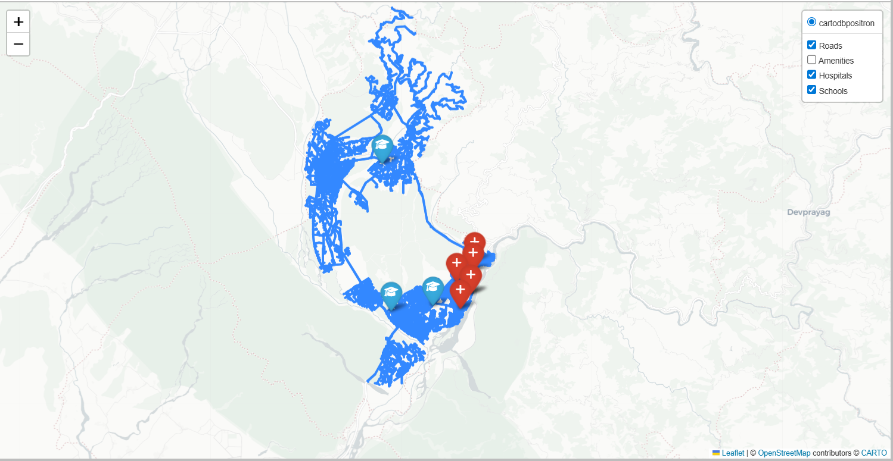
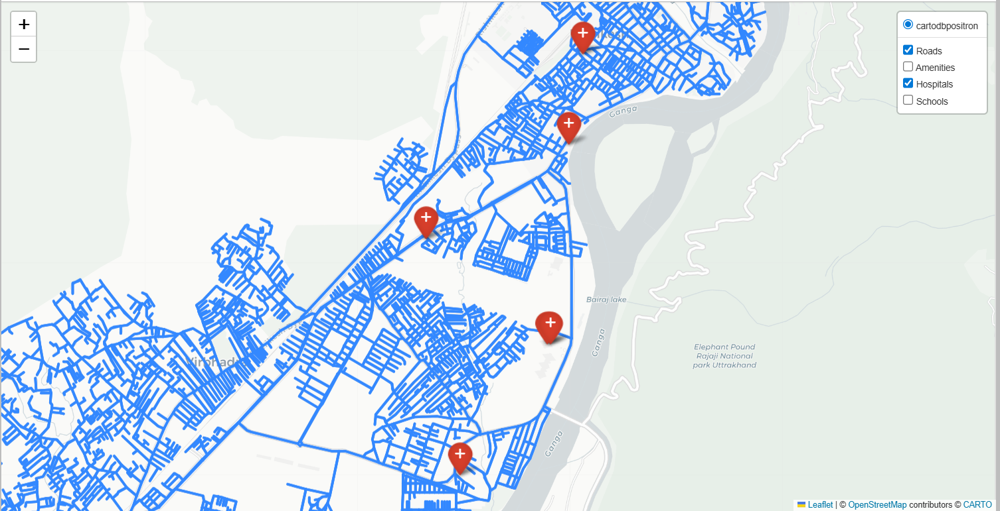
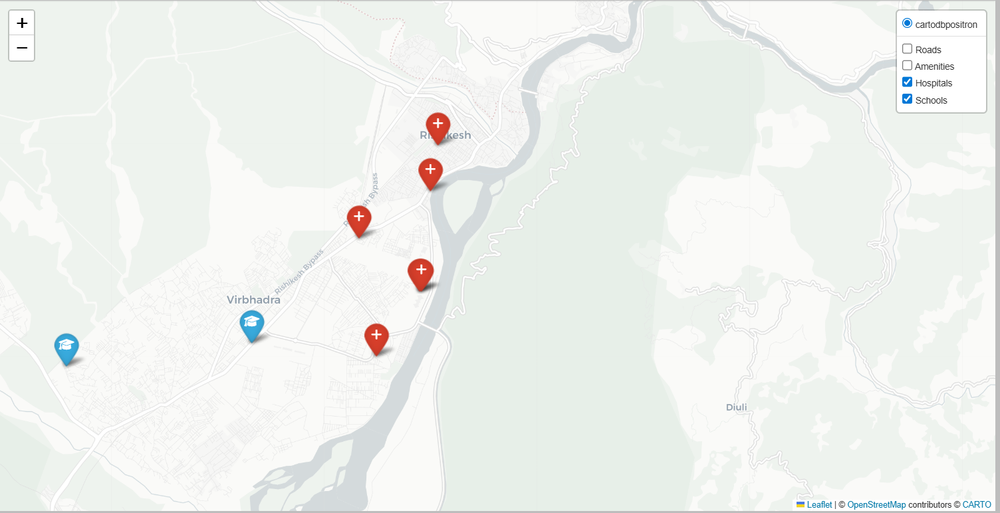

**Interactive GIS Map – Rishikesh**

**Overview**

This project demonstrates how Python can enhance traditional GIS workflows by creating an interactive geospatial map.

**Features**

Road network visualization
Hospitals and schools mapping
Interactive layer control

**Tools Used**

Python
OSMnx
GeoPandas
Folium

**Data Source**

Data sourced from OpenStreetMap (availability may vary).

**Preview**

 

 

👨‍💻 Author

Suranjan
